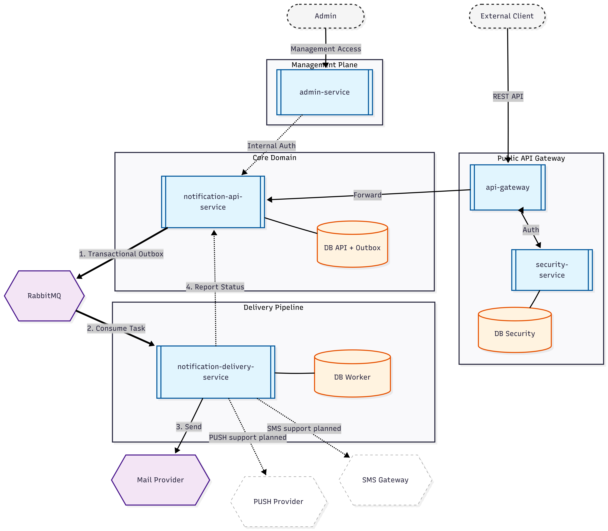

# **MessageBridge**

A microservices-based notification system designed for asynchronous message ingestion, notification delivery, and scheduled sending.

## Highlights

* **Asynchronous Delivery:** Clear separation between request intake and actual delivery execution.
* **Guaranteed Publishing:** Implements the Transactional Outbox pattern to ensure messages are safely published to the broker even if the application crashes.
* **Resilience & Recovery:** Retry-based failure handling with backoff and DLQ routing for controlled recovery.
* **Microservice Architecture:** Fully decoupled services with separate databases.

## Tech Stack

* **Core:** Java 21, Spring Boot 3.3.3
* **Spring Ecosystem:** Spring Web, Validation, Security, Data JPA, AMQP, Actuator, Spring Cloud Gateway
* **Infrastructure & Storage:** PostgreSQL, Flyway, RabbitMQ
* **UI:** Thymeleaf
* **Testing:** JUnit 5, Spring Boot Test, Testcontainers

## System Architecture

<p align="center">

  

</p>
The ecosystem is composed of 5 decoupled Spring Boot microservices:

1. **`api-gateway`** — Single entry point. Handles API-key authentication and rate limiting.
2. **`security-service`** — Internal service responsible for resolving API keys to client metadata and security policies.
3. **`notification-api-service`** — Core API for creating and viewing notifications, managing templates, and publishing tasks via the outbox table.
4. **`notification-delivery-service`** — The worker node that consumes tasks from RabbitMQ, executes SMTP delivery, and applies retry/DLQ logic.
5. **`admin-service`** — A Thymeleaf-based web UI for operators to monitor notifications and manage templates.

**Local Development Infrastructure:**
* 3 separate PostgreSQL databases
* RabbitMQ
* MailHog
* Docker Compose

## Data Flow

1. A client calls `POST /api/v1/notifications` through the `api-gateway` providing an `X-API-Key`.
2. The gateway calls `security-service` (`/internal/security/resolve`) to validate the key and retrieve `clientId`, `rateLimit`, and `clientName`.
3. The gateway strips any untrusted inbound internal headers and injects verified ones (`X-Client-Id`, `X-RateLimit-Per-Min`, `X-Gateway-Auth`).
4. `notification-api-service` validates the payload, applies idempotency checks (via `externalRequestId`), and persists both the notification state and the outbox record in a **single database transaction**.
5. The outbox publisher reads the outbox table and publishes a task message to RabbitMQ.
6. `notification-delivery-service` consumes the task, attempts SMTP delivery via MailHog, and records the attempt.
7. **Failure handling:** On failure, the worker retries with a delay. After the maximum number of attempts is reached, the message is routed to the Dead Letter Queue (DLQ).
8. The worker updates the API about the final delivery result via an internal webhook/endpoint.

## Prerequisites

Before running the project locally, ensure you have the following installed:
* Docker and Docker Compose
* Java 21 (if running outside of Docker)
* Free ports: `8080` (Gateway), `8025` (MailHog UI), `5432` (PostgreSQL), `5672`/`15672` (RabbitMQ)

## Quickstart

### 0. Prepare Configuration

Create a `.env` file by copying the provided example.

```
cp .env.example .env
```

### 1. Start Infrastructure and Services

```
docker compose up --build -d
```

### 2. Create a Notification

The API key must be defined in your `.env` file. You can access the interactive documentation here:

👉 http://localhost:8080/swagger-ui/index.html#/Notifications

1. Enter the API key (default is `demo-123`) for the **X-API-Key**.
2. Find the **POST** `/api/v1/notifications` endpoint.
3. Use the following **Request Body** example:

```
{
  "externalRequestId": "promo-2026-march-001",
  "channel": "EMAIL",
  "to": "customer@example.com",
  "templateCode": "PROMO_DISCOUNT",
  "variables": {
    "customerName": "Alex",
    "discountPercent": "25%",
    "promoCode": "SPRING2026",
    "validUntil": "March 31, 2026",
    "shopUrl": "https://example.com/shop"
  },
  "sendAt": "2026-06-20T09:00:00Z"
}
```

### 3. Check Delivery Status

1. Expand the **GET** `/api/v1/notifications/{id}` method.
2. Paste the UUID you copied earlier into the `id` parameter field.

### 4. Verify Email Delivery

Open the MailHog web interface in your browser to see the intercepted test email:

👉 http://localhost:8025/

### 5. Admin Panel

Access administrative endpoints via the UI Admin Panel:

👉 http://localhost:8090/admin/ui/notifications

**Default credentials:**
- **Username:** `admin`
- **Password:** `admin`

